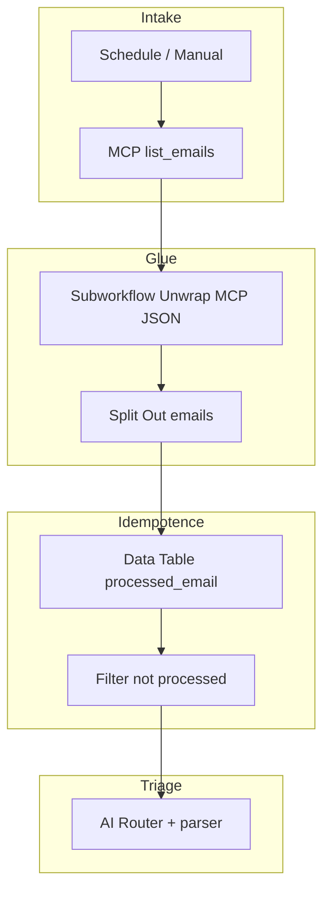

# Audit: custom **Code** vs native n8n patterns

This document records the analysis for the repository workflows: quantitative inventory, intent taxonomy, replacement matrix, WF04 export status, and a pilot refactor plan (**WF01**: [workflow.json](../workflows/wf01-email-dispatch/workflow.json)).

## 1. Executive summary

- **Finding** — most JavaScript is used to (1) unwrap MCP responses (`content[0].text`, `{type,text}` arrays, JSON strings), (2) normalize lists to n8n items, (3) handle idempotency (`$getWorkflowStaticData` or Data Table), (4) apply business filters, (5) render HTML or merge approval state.
- **“Anti low-code” effect** — it is not n8n per se, but an **MCP output contract that is not graph-friendly** which forces repeated glue. The winning strategy: **centralize the glue** (sub-workflow or a single technical node) and express business rules with **Switch**, **Set**, **Filter**, **IF**, **Data Table**, **Item Lists**.
- **Realistic goal** — cut **duplication** and make **business rules visible** on the canvas; chasing **zero Code** everywhere is often counter-productive for complex HTML or tight state machines.

### Metrics (regenerate for up-to-date numbers)

Generated from [inventory-code-nodes.json](inventory-code-nodes.json) (script [inventory-code-nodes.mjs](../tools/inventory-code-nodes.mjs)):

| Metric (re-run the script)                            | Value (last local run, 2026-04-27) |
| ----------------------------------------------------- | ---------------------------------- |
| `workflow.json` files scanned (excl. `fixtures/`)      | 7 (incl. shared unwrap and WF03 portfolio-local UTILs) |
| **Code** nodes counted                                 | 7 (1 per workflow / sub-workflow)   |
| Approx. sum of `jsCode` lines                          | 513                                 |
| Total `jsCode` characters                              | ≈21.5k                              |

**WF04 (current)** — versioned exports under [workflow.json](../workflows/wf04-metadata-enrichment/workflow.json) (canonical) and [workflow.export.snapshot.json](../workflows/wf04-metadata-enrichment/fixtures/workflow.export.snapshot.json). The workflow was reduced to **one** remaining Code node (`Prepare Category Assignments`).

### Regenerate the inventory

```bash
node tools/inventory-code-nodes.mjs
```

Output: `docs/inventory-code-nodes.json`.

---

## 2. WF04 — full export and native refactor

Workflow id: `aze2wAktXHYrTBTr` (n8n cloud), synced with `get_workflow_details`.

### What was implemented

- Full export stored in-repo (`export`, `import`, MCP snapshot).
- Replaced Code node `Filter Documents to Process` with native **Merge** (`mode: combineBySql`) named `Merge Documents to Process`.
- Fixed Data Table warning (`condition: "in" is not supported`) by removing the `in` filter on `Get Processed For Doc`.

### Functional result

- Same business intent: only process documents not in the tracking table, or newer than `lastProcessedDate`.
- The Merge node’s SQL uses a `LEFT JOIN` between normalized documents (`input1`) and tracking rows (`input2`).
- A single Code node remains: `Prepare Category Assignments`.

---

## 3. Intent → n8n pattern matrix

| Intent (taxonomy) | Native pattern | Limit |
| ----------------- | -------------- | ----- |
| **ParseEnvelope** | Sub-workflow *Unwrap MCP*; at chain head: **IF** for `content[0].text` then **Set** with `JSON.parse()`; branches via **Switch** | JSON errors are opaque; multiple envelope shapes |
| **UnwrapArray** | **Item Lists**, **Split Out** | Deep nesting |
| **MapTransform** | **Set** (assignments), sometimes **Edit Fields** | Large `find()` on lists: sometimes still ok in one expression or small Code |
| **FilterBusiness** | **Filter**, **IF** | “First match” rules: **Switch** (rules mode) |
| **DedupeStatic** | Prefer **Data Table** + stable key (WF04) | Static data is less visible to non-coders |
| **DedupeDataTable** | WF04 pattern; **Merge** (enrich) with lookup | Table schema ops |
| **Aggregate** | **Aggregate** (if enabled) or **Item Lists** | — |
| **HtmlTemplate** | Dedicated *Render…* sub-workflow; **Set** chunks; **HTML** node if available | n8n is not a full template engine |
| **StateMerge** | **Data Table** on `(task_id, cycle_id)`; or **Merge** + final **IF** | Parallel approvers: canvas clutter vs visibility |
| **ErrorGuard** | **IF** / **Stop and Error** on MCP error fields; **Error Trigger** on workflow | Depends on exact MCP error shape |

---

## 4. **Code** node deep dive

**Priority** legend: P1 = quick win / high duplication; P3 = acceptable residue or should be modularized.

### WF01 — [workflow.json](../workflows/wf01-email-dispatch/workflow.json)

| Node | LOC | Main intent | Native / architecture | Priority |
| ---- | --- | ----------- | ---------------------- | -------- |
| Parse + Deduplicate | 28 | Envelope + array + static dedupe | *Unwrap MCP* → **Split Out**; idempotency: **Data Table** `email_id` instead of `getWorkflowStaticData` | P1 |

### WF02 — [workflow.json](../workflows/wf02-document-validation/workflow.json)

Refactor completed 2026-04-27 — see [WF02 native refactor](#wf02-native-refactor-2026-04-27) below. Resulting Code surface: **`Render Task Description HTML`** (~5 LOC, HTML-only) + **`Ensure Merge Processed Input`** (~8 LOC, AlaSQL/`combineBySql` guard when `wf02_processed_documents` has zero rows). Earlier rows kept as historical traceability:

| Node (historical) | LOC | Main intent | Replacement (2026-04-27) | Priority | Status |
| ----------------- | --- | ----------- | ------------------------- | -------- | ------ |
| Parse + Deduplicate Docs | 21 | Envelope + static dedupe | Shared **Unwrap MCP JSON** sub-workflow + **Split Out** + **Filter** + **Set** + Data Table `wf02_processed_documents` + **Merge (combineBySql)** LEFT JOIN | P1 | Done |
| Build Task Payload | 19 | Envelope + HTML | Shared unwrap + **Set** (`Build Task Fields`) + residual ~5-LOC `Render Task Description HTML` Code (HTML only, parity with WF01) | P2 | Done |
| Extract Task ID | 8 | Envelope | Shared unwrap + **Set** (`Extract Task ID`, mirrors WF01 `Extract Task Assignment`) + **IF** + **Stop and Error** | P1 | Done |
| Register Approval | 5 | State in static | Data Table `wf02_approvals` (`Ensure Approvals Table` + `Seed Approval Row` upsert keyed by `cycleKey = task_id:cycle_id`) | P2 | Done |
| Parse Approval | 10 | Map from webhook | **Set** (`Parse Approval`) + **IF Valid Approval** + **Stop and Error** | P1 | Done |
| Update Approval State | 12 | State merge + join | Data Table get + **Code** (`Merge Decision`, `runOnceForAllItems`) + Data Table upsert + **Set** (`Compute Join`) — boolean expressions feed existing `IF Join Ready` / `IF Both Approved` | P2 | Done |

### WF03 — [workflow.json](../workflows/wf03-weekly-steering/workflow.json) (see [api-response.snapshot.json](../workflows/wf03-weekly-steering/fixtures/api-response.snapshot.json))

| Node | LOC | Main intent | Native / architecture | Priority |
| ---- | --- | ----------- | ---------------------- | -------- |
| Prepare COPIL Config | — | Dates + env → flat config | **Set** (Luxon `$now` / `Europe/Paris` expressions) | Done |
| Build Report Context | — | Parse + HTML + aggregate | **Execute Workflow** → [UTIL - WF03 build report context](../workflows/wf03-weekly-steering/subworkflows/wf03-build-report-context/workflow.json) (Code); parent: Unwrap + **Set** bundle | Done |
| Compose COPIL Note | — | HTML template | **Execute Workflow** → [UTIL - WF03 compose steering note HTML](../workflows/wf03-weekly-steering/subworkflows/wf03-compose-steering-note-html/workflow.json) (Code); parent **Set** bundle | Done |
| Decide Note Upsert | ~15 | Pick existing note id | Unwrap + small **Code** on `payload` (no duplicate MCP parse) | Residual |
| Prepare Agenda (×2) | — | Agenda body after save | **Unwrap** + **Set** `agendaUpdateInput` / `note_url` | Done |

### WF04 — [workflow.json](../workflows/wf04-metadata-enrichment/workflow.json)

| Node | LOC | Intent | Replacement | Priority |
| ---- | --- | ------ | ----------- | -------- |
| Many earlier Code nodes | 0 | — | Replaced with **IF**, **Set**, **Split Out**, **Merge (SQL)**, see repo history | Done |
| Prepare Category Assignments | 19 | Map category name → `category_id` | Remains **Code** (hierarchy match) | Residual |

---

## 5. Proposed reusable sub-workflows

| Name | Input | Output | Consumers |
| ---- | ----- | ------ | ---------- |
| **Unwrap MCP JSON** | raw MCP / HTTP | parsed JSON item | WF01–04 |
| **MCP list → items** | object w/ `emails` / `tasks` / … | normalized items | tool-specific |
| **Extract task_id** | `create_task` response | `task_id` + passthrough | WF01, WF02 |
| **Post note save → agenda** | saved note + context | `agendaUpdateInput` | WF03: **Unwrap** + **Set** on both branches (no duplicate Code) |

---

## WF02 native refactor (2026-04-27)

Iterates on the WF01 pattern (shared unwrap sub-workflow) plus the WF04 pattern (Data Table + `Merge combineBySql` for idempotency), generalised to a webhook-driven split/join state machine.

### Outcome

- **Code surface** — 6 Code nodes / ~75 LOC → **1** residual node (`Render Task Description HTML`, 4 LOC, HTML-only); approval state and intake idempotency now visible on the canvas.
- **Inventory** — see [inventory-code-nodes.json](inventory-code-nodes.json) entry for `workflows/wf02-document-validation/workflow.json` (`codeNodeCount: 1`).

### Mapping (current → target)

- `Parse + Deduplicate Docs` (Code, 21 LOC) → `Unwrap MCP Search Folder Docs` (Execute Workflow → shared unwrap) + `Coalesce Documents List` (Set: normalises `payload.documents` vs `payload.content` / JSON-in-text) + `Split Out Documents` (`documents`) + `Filter - Has document_id` + `Normalize Docs` (Set: `id`, `updatedDate`, `name`, `url`, `uploader`) + `Get Processed Docs` (Data Table get-all on `wf02_processed_documents`, `executeOnce`) + **`Ensure Merge Processed Input`** (Code — sentinel row when table empty) + `Merge Docs to Process` (Merge `combineBySql` LEFT JOIN, same SQL shape as WF04 `Merge Documents to Process`).
- `Build Task Payload` (Code, 19 LOC) → `Unwrap MCP Get Document` (Execute Workflow) + `Build Task Fields` (Set: `document_id`, `cycle_id`, `docName`, `title`, `author_username`, `docUrl`) + residual `Render Task Description HTML` (Code, ~5 LOC, HTML-only — assembles the description and the final `createTaskInput` like WF01).
- `Extract Task ID` (Code, 8 LOC) → `Unwrap MCP Create Task` (Execute Workflow) + `Extract Task ID` (Set: `task_id` from `payload.task_id || payload.id || payload.task.task_id`; pulls `cycle_id` / `document_id` / `author_username` from `Build Task Fields`) + reused `IF Has Task ID` / `Stop - Missing task_id`.
- `Register Approval State` (Code, 5 LOC, `$getWorkflowStaticData`) → `Ensure Approvals Table` (Data Table create with `createIfNotExists`) at intake start + `Seed Approval Row` (Data Table upsert on `wf02_approvals` keyed by `cycleKey = task_id:cycle_id`, defaults `artistic_decision`/`technical_decision = PENDING`).
- `Parse Approval` (Code, 10 LOC) → `Parse Approval` (Set: reads `body.* ?? query.*`, normalizes role/decision casing, exposes `cycleKey`) + `IF Valid Approval` → `Form End - Invalid Approval` (n8n Form, `operation`: `completion`).
- `Update Approval State` (Code, 12 LOC, static + join math) → `Get Approval Rows` (Data Table get-all, `executeOnce`) + `Merge Decision` (**Code**: lookup row by `cycleKey`, role-conditional `<role>_decision`/`<role>_reason`/`<role>_at`) + `Upsert Approval Row` (Data Table upsert on `wf02_approvals`) + `Compute Join` (Set: `joinReady` / `bothApproved` boolean expressions). The existing `IF Join Ready` / `IF Both Approved` are reused unchanged.

### Persistence (new)

- **`wf02_processed_documents`** — `documentId` (string), `lastProcessedDate` (date/dateTime), `cycleId` (string). Self-bootstrapped with `Ensure Tracking Table` (`createIfNotExists`).
- **`wf02_approvals`** — `cycleKey`, `task_id`, `cycle_id`, `document_id`, `author_username`, `artistic_decision/reason/at`, `technical_decision/reason/at`. Self-bootstrapped with `Ensure Approvals Table`.

### Deploy chain

- [subworkflow-dependencies.json](../workflows/wf02-document-validation/subworkflow-dependencies.json) declares `unwrap-mcp-json` with `parentExecuteWorkflowNodeNames: ["Unwrap MCP Search Folder Docs", "Unwrap MCP Get Document", "Unwrap MCP Create Task"]` (parity with [WF01 manifest](../workflows/wf01-email-dispatch/subworkflow-dependencies.json)).
- Validation gate: `./tools/validate-workflow.sh wf02` (mandatory; see [.cursor/skills/n8n-workflow-deploy-gate/SKILL.md](../.cursor/skills/n8n-workflow-deploy-gate/SKILL.md)).
- REST publish: `./deploy.sh wf02` (auto-deploys the unwrap dependency first and injects its remote id from `N8N_WORKFLOW_ID_UNWRAP` into the three Execute Workflow nodes before the parent PUT).

### Justified residues

- `Render Task Description HTML` keeps the same role and shape as WF01: HTML composition + final `createTaskInput` assembly. Repeated string concatenation in a Set expression was rejected in favour of a 4-LOC Code node for readability — same trade-off recorded in WF01.

---

## 6. Pilot: WF01 refactor (`workflows/wf01-email-dispatch/workflow.json`)

**Rationale** — “MCP-first” file, repeated parse blocks, no webhook state machine (unlike WF02).

### Target graph (logic)



### Suggested order

1. Harden the shared *Unwrap MCP* sub-workflow.  
2. Trade static dedupe in Code for **Data Table** (WF04 style).  
3. Keep HTML rendering in one Code until a maintainable template path exists.  

### Justified residues

- Highly heterogeneous envelopes if the MCP server drifts (isolate in the sub-workflow).  
- Heavy `find()` on large lists if **Item Lists** is no clearer.

---

## 7. Internal references

| Artifact | Path |
| -------- | ---- |
| Machine inventory | [inventory-code-nodes.json](inventory-code-nodes.json) |
| Inventory script | [inventory-code-nodes.mjs](../tools/inventory-code-nodes.mjs) |
| WF04 technical | [SPEC.technical.md](../workflows/wf04-metadata-enrichment/SPEC.technical.md) |
| WF04 functional | [SPEC.functional.md](../workflows/wf04-metadata-enrichment/SPEC.functional.md) |

---

## 8. Conclusion

Low-code stays honest when **business rules live in Switch/Filter/Data Table** and the **MCP glue is one brick**, not six copies of `parseMaybeEnvelope`. The pilot consolidated **Unwrap MCP JSON** as a shared sub-workflow ([WF01 pilot in section 6](#6-pilot-wf01-refactor-workflowswf01-email-dispatchworkflowjson) and the [WF02 native refactor](#wf02-native-refactor-2026-04-27)), and propagated the WF04 Data Table + `Merge combineBySql` idempotency pattern to WF02. **Open work:** WF03 still hosts heavy HTML/report Code in portfolio-local UTILs under `workflows/wf03-weekly-steering/subworkflows/`; future iterations should evaluate whether WF03/WF04 can also subscribe to the shared unwrap sub-workflow and whether a small `Extract task_id` sub-workflow is worth factoring out of the WF01/WF02 Set duplicates.
