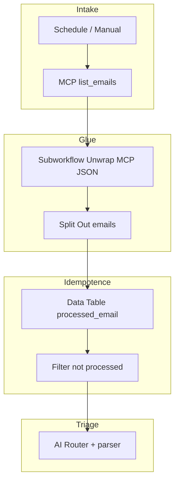

# Audit: custom **Code** vs native n8n patterns

This document records the analysis for the repository workflows: quantitative inventory, intent taxonomy, replacement matrix, WF04 export status, and a pilot refactor plan (**WF01**: [workflow.json](../workflows/wf01-email-dispatch/workflow.json)).

## 1. Executive summary

- **Finding** — most JavaScript is used to (1) unwrap MCP responses (`content[0].text`, `{type,text}` arrays, JSON strings), (2) normalize lists to n8n items, (3) handle idempotency (`$getWorkflowStaticData` or Data Table), (4) apply business filters, (5) render HTML or merge approval state.
- **“Anti low-code” effect** — it is not n8n per se, but an **MCP output contract that is not graph-friendly** which forces repeated glue. The winning strategy: **centralize the glue** (sub-workflow or a single technical node) and express business rules with **Switch**, **Set**, **Filter**, **IF**, **Data Table**, **Item Lists**.
- **Realistic goal** — cut **duplication** and make **business rules visible** on the canvas; chasing **zero Code** everywhere is often counter-productive for complex HTML or tight state machines.

### Metrics (regenerate for up-to-date numbers)

Generated from [inventory-code-nodes.json](inventory-code-nodes.json) (script [inventory-code-nodes.mjs](../tools/inventory-code-nodes.mjs)):

| Metric (re-run the script) | Value (last local run) |
| -------------------------- | ---------------------- |
| `workflow.json` files scanned (excl. `fixtures/`) | 5 |
| **Code** nodes counted | 15 |
| Approx. sum of `jsCode` lines | 551 |
| Total `jsCode` characters | ≈27k |

**WF04 (current)** — versioned exports under [workflow.json](../workflows/wf04-metadata-enrichment/workflow.json) (canonical) and [workflow.export.snapshot.json](../workflows/wf04-metadata-enrichment/fixtures/workflow.export.snapshot.json). The workflow was reduced to **one** remaining Code node (`Prepare Category Assignments`).

### Regenerate the inventory

```bash
node tools/inventory-code-nodes.mjs
```

Output: `docs/inventory-code-nodes.json`.

---

## 2. WF04 — full export and native refactor

Workflow id: `aze2wAktXHYrTBTr` (n8n cloud), synced with `get_workflow_details`.

### What was implemented

- Full export stored in-repo (`export`, `import`, MCP snapshot).
- Replaced Code node `Filter Documents to Process` with native **Merge** (`mode: combineBySql`) named `Merge Documents to Process`.
- Fixed Data Table warning (`condition: "in" is not supported`) by removing the `in` filter on `Get Processed For Doc`.

### Functional result

- Same business intent: only process documents not in the tracking table, or newer than `lastProcessedDate`.
- The Merge node’s SQL uses a `LEFT JOIN` between normalized documents (`input1`) and tracking rows (`input2`).
- A single Code node remains: `Prepare Category Assignments`.

---

## 3. Intent → n8n pattern matrix

| Intent (taxonomy) | Native pattern | Limit |
| ----------------- | -------------- | ----- |
| **ParseEnvelope** | Sub-workflow *Unwrap MCP*; at chain head: **IF** for `content[0].text` then **Set** with `JSON.parse()`; branches via **Switch** | JSON errors are opaque; multiple envelope shapes |
| **UnwrapArray** | **Item Lists**, **Split Out** | Deep nesting |
| **MapTransform** | **Set** (assignments), sometimes **Edit Fields** | Large `find()` on lists: sometimes still ok in one expression or small Code |
| **FilterBusiness** | **Filter**, **IF** | “First match” rules: **Switch** (rules mode) |
| **DedupeStatic** | Prefer **Data Table** + stable key (WF04) | Static data is less visible to non-coders |
| **DedupeDataTable** | WF04 pattern; **Merge** (enrich) with lookup | Table schema ops |
| **Aggregate** | **Aggregate** (if enabled) or **Item Lists** | — |
| **HtmlTemplate** | Dedicated *Render…* sub-workflow; **Set** chunks; **HTML** node if available | n8n is not a full template engine |
| **StateMerge** | **Data Table** on `(task_id, cycle_id)`; or **Merge** + final **IF** | Parallel approvers: canvas clutter vs visibility |
| **ErrorGuard** | **IF** / **Stop and Error** on MCP error fields; **Error Trigger** on workflow | Depends on exact MCP error shape |

---

## 4. **Code** node deep dive

**Priority** legend: P1 = quick win / high duplication; P3 = acceptable residue or should be modularized.

### WF01 — [workflow.json](../workflows/wf01-email-dispatch/workflow.json)

| Node | LOC | Main intent | Native / architecture | Priority |
| ---- | --- | ----------- | ---------------------- | -------- |
| Parse + Deduplicate | 28 | Envelope + array + static dedupe | *Unwrap MCP* → **Split Out**; idempotency: **Data Table** `email_id` instead of `getWorkflowStaticData` | P1 |

### WF02 — [workflow.json](../workflows/wf02-document-validation/workflow.json)

| Node | LOC | Main intent | Native / architecture | Priority |
| ---- | --- | ----------- | ---------------------- | -------- |
| Parse + Deduplicate Docs | 21 | Envelope + static dedupe | Shared unwrap; **Data Table** with `docId:updated` key | P1 |
| Build Task Payload | 19 | Envelope + HTML | Unwrap + **Set**; description HTML in small sub-workflow | P2 |
| Extract Task ID | 8 | Envelope | *Extract task_id* sub-workflow | P1 |
| Register Approval | 5 | State in static | **Data Table** row for `task_id:cycle_id` with columns for artistic/technical | P2 |
| Parse Approval | 10 | Map from webhook | **Set** from `$json.body` / `query` + **IF** validation | P1 |
| Update Approval State | 12 | State merge + join | **Data Table** or minimal Code for join math | P2 |

### WF03 — [workflow.json](../workflows/wf03-weekly-steering/workflow.json) (see [api-response.snapshot.json](../workflows/wf03-weekly-steering/fixtures/api-response.snapshot.json))

| Node | LOC | Main intent | Native / architecture | Priority |
| ---- | --- | ----------- | ---------------------- | -------- |
| Prepare COPIL Config | 41 | Date math | **Date & Time** + **Set** | P2 |
| Build Report Context | 142 | Parse + HTML + aggregate | Unwrap; table rows: **Item Lists**; `status_counts`: **Aggregate**; HTML: dedicated sub-workflow or documented Code | P3 |
| Compose COPIL Note | 194 | HTML template | Single “compose HTML” sub-workflow; static pieces in **Set** | P3 |
| Decide Note Upsert | 30 | Unwrap + pick existing | Unwrap + **IF** on title; **Set** `should_update_note` | P2 |
| Prepare Agenda (×2) | 15 each | Unwrap + HTML string for agenda | One shared sub-workflow *post-save → agenda* | P1 |

### WF04 — [workflow.json](../workflows/wf04-metadata-enrichment/workflow.json)

| Node | LOC | Intent | Replacement | Priority |
| ---- | --- | ------ | ----------- | -------- |
| Many earlier Code nodes | 0 | — | Replaced with **IF**, **Set**, **Split Out**, **Merge (SQL)**, see repo history | Done |
| Prepare Category Assignments | 19 | Map category name → `category_id` | Remains **Code** (hierarchy match) | Residual |

---

## 5. Proposed reusable sub-workflows

| Name | Input | Output | Consumers |
| ---- | ----- | ------ | ---------- |
| **Unwrap MCP JSON** | raw MCP / HTTP | parsed JSON item | WF01–04 |
| **MCP list → items** | object w/ `emails` / `tasks` / … | normalized items | tool-specific |
| **Extract task_id** | `create_task` response | `task_id` + passthrough | WF01, WF02 |
| **Post note save → agenda** | saved note + context | `agendaUpdateInput` | WF03 (removes Update/Create duplication) |

---

## 6. Pilot: WF01 refactor (`workflows/wf01-email-dispatch/workflow.json`)

**Rationale** — “MCP-first” file, repeated parse blocks, no webhook state machine (unlike WF02).

### Target graph (logic)



### Suggested order

1. Harden the shared *Unwrap MCP* sub-workflow.  
2. Trade static dedupe in Code for **Data Table** (WF04 style).  
3. Keep HTML rendering in one Code until a maintainable template path exists.  

### Justified residues

- Highly heterogeneous envelopes if the MCP server drifts (isolate in the sub-workflow).  
- Heavy `find()` on large lists if **Item Lists** is no clearer.

---

## 7. Internal references

| Artifact | Path |
| -------- | ---- |
| Machine inventory | [inventory-code-nodes.json](inventory-code-nodes.json) |
| Inventory script | [inventory-code-nodes.mjs](../tools/inventory-code-nodes.mjs) |
| WF04 technical | [SPEC.technical.md](../workflows/wf04-metadata-enrichment/SPEC.technical.md) |
| WF04 functional | [SPEC.functional.md](../workflows/wf04-metadata-enrichment/SPEC.functional.md) |

---

## 8. Conclusion

Low-code stays honest when **business rules live in Switch/Filter/Data Table** and the **MCP glue is one brick**, not six copies of `parseMaybeEnvelope`. The next practical iteration is: consolidate **Unwrap**, pilot **WF01** as above, then teach WF02 the same idempotency pattern as WF04.
