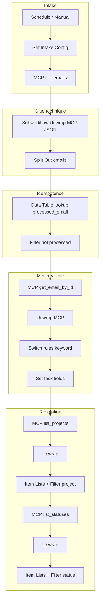

# Audit « code custom » vs constructions natives n8n

Ce document implémente l’analyse prévue pour les workflows du dépôt : inventaire quantitatif, taxonomie par intention, matrice de remplacement, statut d’export WF04, et spécification d’un refactor pilote (**WF01** fichier [workflow-01-email-to-task.json](../workflows/workflow-01-email-to-task.json)).

## 1. Synthèse exécutive

- **Constat** : la majorité du JavaScript sert à (1) déballer les réponses MCP (`content[0].text`, tableaux `{type,text}`, chaînes JSON), (2) normaliser des listes en items n8n, (3) gérer l’idempotence (`$getWorkflowStaticData` ou Data Table), (4) appliquer des règles ou filtres métier, (5) composer du HTML ou un état d’approbation.
- **Effet « anti low-code »** : ce n’est pas n8n en soi, mais un **contrat de sortie MCP non structuré pour le graphe** qui impose du glue répété. La stratégie gagnante est : **centraliser le glue** (sous-workflow ou nœud technique unique), puis **exprimer le métier** en **Switch**, **Set**, **Filter**, **IF**, **Data Table**, **Item Lists**.
- **Objectif réaliste** : réduire la **duplication** et rendre le **métier visible** sur le canevas ; viser **zéro Code** partout est souvent contre-productif pour HTML complexe ou machines d’état serrées.

### Chiffres (dépôt au moment de l’audit)

Données générées par [inventory-code-nodes.json](inventory-code-nodes.json) (script [inventory-code-nodes.mjs](../scripts/inventory-code-nodes.mjs)) :

| Métrique | Valeur |
|----------|--------|
| Fichiers JSON workflows analysés | 5 |
| Nœuds `Code` recensés | 28 |
| Somme des lignes `jsCode` (approx.) | 720 |
| Caractères `jsCode` total | ~33 800 |

**WF04** : les 7 nœuds Code apparaissent dans l’export [workflow-04-document-enrichment-ai.export.json](../workflows/workflow-04-document-enrichment-ai.export.json) **sans** `parameters.jsCode` — les lignes ci-dessus incluent donc **0** caractère utile pour WF04 dans le dépôt. Le rôle fonctionnel de ces nœuds est décrit dans [wf04-code-nodes-from-spec.json](wf04-code-nodes-from-spec.json) (dérivé de [workflow-04-document-enrichment-ai.md](../../workflow-04-document-enrichment-ai.md)).

### Régénérer l’inventaire

```bash
node n8n/scripts/inventory-code-nodes.mjs
```

Sortie : `n8n/docs/inventory-code-nodes.json`.

---

## 2. WF04 — export complet dans le dépôt

**Constat** : aucun outil MCP n8n n’est disponible dans ce workspace pour rappeler `get_workflow_details` avec le corps des nœuds ; l’export JSON présent est un inventaire allégé.

**Action** : exporter depuis l’UI n8n le workflow id `aze2wAktXHYrTBTr`, puis remplacer le JSON du dépôt par un export **complet** (tous les `parameters`). Les étapes exactes sont listées dans [wf04-code-nodes-from-spec.json](wf04-code-nodes-from-spec.json) (`reexportInstructions`).

---

## 3. Matrice intention → constructions n8n

| Intention (taxonomie) | Nœuds / patterns natifs | Limite |
|----------------------|-------------------------|--------|
| **ParseEnvelope** | Sous-workflow `Unwrap MCP Response` ; en tête de chaîne : **IF** sur présence de `content[0].text` puis **Set** avec `JSON.parse()` ; variantes = **Switch** | Erreurs JSON peu lisibles ; plusieurs formes d’enveloppe |
| **UnwrapArray** | **Item Lists**, **Split Out** | Schémas très imbriqués |
| **MapTransform** | **Set** (assignations), parfois **Edit Fields** | Logique `find()` sur grandes listes : acceptable en une expression ou petit Code |
| **FilterBusiness** | **Filter**, **IF** | Règles « premier match » : **Switch** (rules) |
| **DedupeStatic** | Préférer **Data Table** + clé stable (comme WF04) | Static data peu visible pour un non-tech |
| **DedupeDataTable** | Déjà pattern WF04 ; **Merge** (enrich) avec résultat lookup | Ops : schéma table |
| **Aggregate** | **Aggregate** (si activé sur l’instance) ou **Item Lists** | — |
| **HtmlTemplate** | Sous-workflow dédié « Render … » ; **Set** avec morceaux ; parfois **HTML** si disponible | n8n n’est pas un moteur de template riche |
| **StateMerge** | **Data Table** par `(task_id, cycle_id)` ; ou **Merge** de branches + **IF** final | Deux validations parallèles : lisibilité vs nombre de nœuds |
| **ErrorGuard** | **IF** / **Stop and Error** sur champs d’erreur MCP ; **Error Trigger** workflow | Selon forme exacte des erreurs MCP |

---

## 4. Tableau détaillé par nœud Code

Légende **Priorité** : P1 = gain rapide / forte duplication ; P3 = résidu acceptable ou modularisation.

### WF01 — [workflow-01-email-to-task.json](../workflows/workflow-01-email-to-task.json)

| Nœud | LOC | Intention principale | Remplacement natif / architecture | Priorité |
|------|-----|----------------------|-----------------------------------|----------|
| Parse + Deduplicate Emails | 28 | ParseEnvelope + UnwrapArray + DedupeStatic | Sous-workflow **Unwrap MCP** → **Split Out** emails ; idempotence : **Data Table** `email_id` (comme WF04) au lieu de `getWorkflowStaticData` | P1 |
| Normalize + Qualify | 46 | MapTransform + FilterBusiness | **Switch** sur `subject`+`body` (contains) en branches → **Set** pour `priority`, `assignee`, `slaHours` ; date d’échéance : **Date & Time** ou expression dans **Set** | P1 |
| Resolve Project | 20 | ParseEnvelope + MapTransform | Unwrap partagé puis **Item Lists** + **Filter** (`name` égal / contient) + **Limit** 1 + **Set** `projectId` | P1 |
| Resolve Status | 17 | ParseEnvelope + MapTransform | Idem pour statuts « todo » / **Filter** + **Set** `statusId` | P1 |
| Normalize Create Result | 20 | ParseEnvelope + MapTransform | **Set** avec expressions sur payload déjà unwrap (si sortie MCP stable) ; sinon mini sous-workflow « Extract task_id » | P2 |
| Detect Overdue + Escalation | 36 | ParseEnvelope + FilterBusiness | Unwrap `tasks` → **Split Out** ; **Filter** sur `dueDate` ; **Set** `overdueHours` ; **IF** `needsEscalation` | P2 |

### WF01 — variante [workflow-01-email-to-task.live.export.json](../workflows/workflow-01-email-to-task.live.export.json)

| Nœud | LOC | Intention | Remplacement | Priorité |
|------|-----|-----------|--------------|----------|
| Parse MCP Envelope | 8 | ParseEnvelope + UnwrapArray | Même sous-workflow Unwrap + **Item Lists** | P1 |
| Build Payload From AI | 23 | MapTransform + ErrorGuard (garde-fous IA) | Partiellement **Switch** / **IF** sur champs structurés ; garde strict (confidence) souvent plus lisible en **IF** multiples + **Set** | P2 |
| Extract Task For Assign | 10 | ParseEnvelope + ErrorGuard | **Set** + **Stop and Error** si pas de `task_id` | P2 |

### WF02 — [workflow-02-validation-documentaire.json](../workflows/workflow-02-validation-documentaire.json)

| Nœud | LOC | Intention | Remplacement | Priorité |
|------|-----|-----------|--------------|----------|
| Parse + Deduplicate Docs | 21 | ParseEnvelope + DedupeStatic + UnwrapArray | Unwrap MCP partagé ; dédup : **Data Table** clé `docId:updatedDate` ; **Filter** vs table | P1 |
| Build Task Payload | 19 | ParseEnvelope + HtmlTemplate + MapTransform | Unwrap + **Set** champs texte ; description HTML : **Set** multi-champs ou sous-workflow « Build validation description » | P2 |
| Extract Task ID | 8 | ParseEnvelope | Sous-workflow **Extract MCP entity id** | P1 |
| Register Approval State | 5 | StateMerge + DedupeStatic | **Data Table** ligne par `task_id:cycle_id` avec colonnes `art`, `tech` ; ou garder Code minimal | P2 |
| Parse Approval | 10 | MapTransform | **Set** depuis `$json.body` / `$json.query` si webhook fixe ; **IF** validation champs | P1 |
| Update Approval State | 12 | StateMerge | **Data Table** + **Set** / **IF** pour `joinReady`, `bothApproved` ; alternative : deux webhooks → **Merge** puis **IF** | P2 |

### WF03 — [workflow-03-reporting-hebdo.server.json](../workflows/workflow-03-reporting-hebdo.server.json)

| Nœud | LOC | Intention | Remplacement | Priorité |
|------|-----|-----------|--------------|----------|
| Prepare COPIL Config | 41 | MapTransform (dates) | **Date & Time** + **Set** pour `meeting_date`, `next_meeting_date`, etc. ; liste participants : **Set** avec `split()` en expression | P2 |
| Build Report Context | 142 | composite (Parse + Html + Aggregate) | Unwrap MCP ; projection lignes : **Item Lists** ; `status_counts` : **Aggregate** ; HTML tableau : sous-workflow ou résidu Code documenté | P3 |
| Compose COPIL Note | 194 | HtmlTemplate | Sous-workflow unique « Compose COPIL HTML » (réduit la dispersion) ; morceaux statiques en **Set** | P3 |
| Decide Note Upsert | 30 | ParseEnvelope + MapTransform | Unwrap + **Filter** / **IF** sur titre ; **Set** `should_update_note` | P2 |
| Prepare Agenda Update After Update / Create | 15 chacun | ParseEnvelope + HtmlTemplate | Factoriser en **un** sous-workflow « Post-save note → agenda input » (duplication actuelle) | P1 |

### WF04 — export incomplet (voir §2)

| Nœud | LOC (repo) | Intention (spec) | Remplacement probable | Priorité |
|------|------------|------------------|----------------------|----------|
| Validate Input | 0 | ErrorGuard | **IF** + **Stop and Error** | P1 |
| Resolve Space | 0 | MapTransform | **Item Lists** + **Filter** sur nom d’espace | P1 |
| Normalize Documents | 0 | UnwrapArray | **Item Lists** / **Set** | P1 |
| Filter Documents to Process | 0 | FilterBusiness | **Filter** + comparaison à **Data Table** (déjà dans le flux) | P1 |
| Check Description Result | 0 | ErrorGuard | **IF** sur erreur MCP | P1 |
| Prepare Category Assignments | 0 | MapTransform | **Switch** / table de correspondance + **Set** | P2 |
| Check Assign Result | 0 | ErrorGuard | **IF** | P1 |

---

## 5. Sous-workflows réutilisables proposés

| Nom | Entrée | Sortie | Consommateurs |
|-----|--------|--------|----------------|
| **Unwrap MCP JSON** | Item brut MCP / HTTP | JSON métier parsé (un item) | WF01, WF02, WF03, WF04 |
| **MCP list → items** | Objet avec `emails` / `documents` / `tasks` / `notes` | N items normalisés | Selon outil MCP |
| **Extract task_id** | Réponse `create_task` | `task_id` numérique + passe-through champs | WF01, WF02 |
| **Post note save → agenda** | `saved_note`, contexte COPIL | `agendaUpdateInput` | WF03 (supprime doublon Update/Create) |

---

## 6. Pilote de refactor : WF01 (`workflow-01-email-to-task.json`)

**Choix** : WF01 fichier « MCP-first » — duplication maximale de `parseMaybeEnvelope`, règles de qualification lisibles, pas de machine d’état webhook comme WF02.

### Graphe cible (logique)



### Étapes concrètes (ordre recommandé)

1. Créer le sous-workflow **Unwrap MCP JSON** (une entrée, une sortie) ; remplacer chaque premier bloc parse des réponses MCP par un appel **Execute Workflow**.
2. Remplacer **Parse + Deduplicate Emails** par : Unwrap → **Split Out** → **Data Table** (lookup batch ou par item selon perf) → **Filter**.
3. Remplacer **Normalize + Qualify** par un **Switch** (ex. règles sur concat `subject` + `body`) relié à des **Set** pour priorité, assigné, SLA.
4. Remplacer **Resolve Project** / **Resolve Status** par **Item Lists** + **Filter** + **Set** (en conservant les nœuds MCP existants).
5. **Detect Overdue** : unwrap `list_tasks` → **Split Out** → **Filter** dates → **Set** métriques → **IF** escalade (déjà partiellement présent après le Code).

### Ce qui peut rester en Code (résidu justifié)

- Enveloppes MCP **très** hétérogènes si le serveur change souvent (mieux isolé dans le sous-workflow).
- Expressions `find()` complexes sur listes volumineuses si **Item Lists** devient verbeux sans gain clarté.

---

## 7. Références internes

| Artefact | Chemin |
|----------|--------|
| Inventaire machine | [inventory-code-nodes.json](inventory-code-nodes.json) |
| Script d’inventaire | [inventory-code-nodes.mjs](../scripts/inventory-code-nodes.mjs) |
| Spec WF04 sans jsCode | [wf04-code-nodes-from-spec.json](wf04-code-nodes-from-spec.json) |
| Spec fonctionnelle WF04 | [workflow-04-document-enrichment-ai.md](../../workflow-04-document-enrichment-ai.md) |

---

## 8. Conclusion

L’argument « low-code » tient si le **graphe expose les décisions métier** (Switch, Filter, Data Table) et si le **glue MCP** est **une brique réutilisable** plutôt que six copies du même `parseMaybeEnvelope`. La prochaine itération concrète du dépôt peut commencer par le **sous-workflow Unwrap** + **pilote WF01** ci-dessus, puis aligner WF02 sur le même modèle d’idempotence que WF04.
