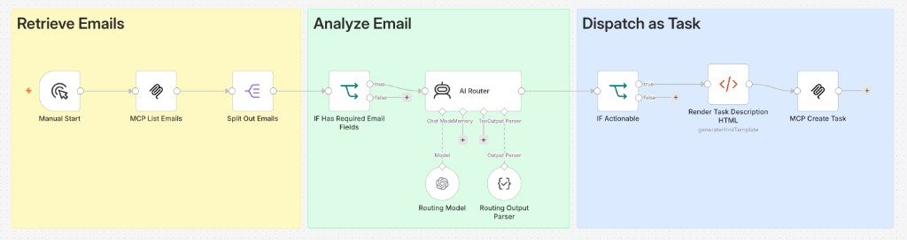

# WF01 — Email dispatch (external signal → eXo tasks)

**TL;DR** — Ingest mail through eXo MCP, **unwrap** responses, let a **structured LLM** decide if a message is truly actionable, then **create and assign** a project task when confidence and policy allow. The point of the demo: not every email should create work.

## Video walkthrough

Prefer a short screencast before the long read? Replace the placeholder with your published URL (or embed) when ready.

**Short video:** *TBD*

## n8n canvas (overview)



Email intake → unwrap → per-item AI triage → task create/assign. For the exact sequence and node names, open [`workflow.json`](workflow.json) in n8n or read [SPEC.technical.md](SPEC.technical.md) (section 4).

---

## Problem context

Project teams still receive **actionable** and **informational** email in the same channel. Manually triaging mail and re-typing requests into eXo is slow; auto-creating a task for every message creates **noise** and undermines trust in automation.

## Automation objective

- **Ingest** a batch of recent messages.
- **Normalize** fields and drop invalid items.
- **Classify** with a small, contract-based LLM output (action required, response expected, confidence, assignee, priority, title, summary).
- **Create** a task in a **known eXo project** and **assign** it to a resolved user when—and only when—guardrails pass.
- **Stop with a clear error** if create returns no `task_id` (defect or contract mismatch).

## Prerequisites (eXo tenant and n8n)

Create or locate the following **on eXo**, then copy identifiers into n8n **variables / workflow parameters** as needed (see [SPEC.technical.md](SPEC.technical.md) §3 and [config.env.example](config.env.example) for naming).

**eXo**


| Prerequisite                                                                                 | Why                                                                                                                                                                                                                      |
| -------------------------------------------------------------------------------------------- | ------------------------------------------------------------------------------------------------------------------------------------------------------------------------------------------------------------------------ |
| **MCP endpoint** reachable with tools `list_emails`, `create_task_in_project`, `assign_task` | Core automation path ([SPEC.technical.md](SPEC.technical.md) §2).                                                                                                                                                        |
| **Task project** — numeric **`project_id`** where tasks are created | Mapped from **`WF01_PROJECT_ID`** when set; otherwise the demo default is **`3`** (project name shown in your tenant). Confirm the id in UI or with MCP `list_projects`. |
| **Assignee usernames** (`louis`, `claire`, `lucie`)                                          | LLM output is constrained and mapped with fallback ([SPEC.technical.md](SPEC.technical.md) §6). Users **must exist** under those **login names** on your tenant **or** adjust the workflow mapping to match your roster. |
| **Mailbox visibility** for `list_emails`                                                     | The identity used by the n8n **MCP OAuth** credential must be able to list the **Art2Rue**-style demo mail; no mail → nothing to process.                                                                                |


**n8n**


| Prerequisite                                                                                                                                                                                                                                 | Why                                                                                                                    |
| -------------------------------------------------------------------------------------------------------------------------------------------------------------------------------------------------------------------------------------------- | ---------------------------------------------------------------------------------------------------------------------- |
| **MCP Client** credential + **`EXO_MCP_ENDPOINT`** (or graph default to your tenant URL)                                                                                                                                                     | All eXo steps go through MCP.                                                                                          |
| **LLM / OpenAI** credentials for the routing + parser chain                                                                                                                                                                                  | Structured triage node(s) require a configured model (see `workflow.json` and [SPEC.technical.md](SPEC.technical.md)). |
| **Sub-workflow** **Unwrap MCP JSON** deployed and **`N8N_WORKFLOW_ID_UNWRAP`** in root `.env` when using **REST deploy** ([subworkflow-dependencies.json](subworkflow-dependencies.json), [docs/DEVELOPMENT.md](../../docs/DEVELOPMENT.md)). | Required for dependency id injection during REST deployment. |


**Out of scope for a first run (per [SPEC.functional.md](SPEC.functional.md))** — persisted idempotency by `emailId`, dynamic project discovery, REST fallback: not required to **start** the demo.

## High-level flow (conceptual)

1. **Trigger** — manual or scheduled intake.
2. **List emails** — MCP `list_emails`, then **Unwrap MCP JSON** (shared sub-workflow) so the graph works on plain data.
3. **One item per message** — split and **normalize** `emailId`, subject, body, sender, received time.
4. **Filter** — require a stable `emailId`.
5. **LLM triage** — structured output + **IF** branch: only “clearly actionable” mail continues.
6. **Build task payload** — map allowed assignees and priorities, render a small **HTML** task body.
7. **Create task** — `create_task_in_project` + unwrap; **extract** `task_id` and assignee username.
8. **Assign** — `assign_task` on success; **error stop** if `task_id` is missing.

## n8n design choices (not a node-by-node list)


| Area         | Choice                                 | Why                                                                                              |
| ------------ | -------------------------------------- | ------------------------------------------------------------------------------------------------ |
| MCP decoding | **Execute Workflow → Unwrap MCP JSON** | MCP tools often return envelopes; one shared UTIL keeps the parent readable.                     |
| Volume       | **Split Out** after unwrap             | Natural “one execution thread per email” for downstream AI and MCP.                              |
| Policy       | **Structured LLM + IF**                | Keeps business rules **explicit** (thresholds, booleans) instead of hiding them in prompts only. |
| Side effects | **Create before assign**               | Matches MCP contracts and surfaces creation failures early.                                      |
| HTML         | **Minimal Code** for description       | Keeps HTML generation localized; see functional spec for rationale.                              |


## MCP eXo interaction model

Tools used in this workflow (see [SPEC.technical.md](SPEC.technical.md)):

- `list_emails` — intake.
- `create_task_in_project` — task creation in a configured **project**.
- `assign_task` — explicit assignment using MCP `username`.

After MCP nodes that return wrapped JSON, the graph calls the shared **[Unwrap MCP JSON](../shared/subworkflows/unwrap-mcp-json/)** sub-workflow again so downstream nodes extract `task_id` and payloads reliably.

## Operational considerations

- **Variables:** `EXO_MCP_ENDPOINT`; optional `WF01_PROJECT_ID` (defaults documented in [SPEC.technical.md](SPEC.technical.md)).
- **Limits (product):** no persisted email idempotency yet—re-runs may duplicate tasks if messages are still listed; see [SPEC.functional.md](SPEC.functional.md) out-of-scope section.
- **Assignees:** LLM output is mapped to an **allow-list** of demo users with fallback (see technical spec §6).

## References


| Artifact                                                                           | Role                                             |
| ---------------------------------------------------------------------------------- | ------------------------------------------------ |
| [workflow.json](workflow.json)                                                     | Canonical n8n export.                            |
| [SPEC.functional.md](SPEC.functional.md)                                           | Goals, acceptance criteria, business rules.      |
| [SPEC.technical.md](SPEC.technical.md)                                             | MCP sequence, variables, LLM contract, payloads. |
| [subworkflow-dependencies.json](subworkflow-dependencies.json)                     | Deploy order for Unwrap dependency.              |
| [../shared/subworkflows/unwrap-mcp-json/](../shared/subworkflows/unwrap-mcp-json/) | Shared MCP unwrap UTIL.                          |


---

## REST deploy

From the repository root, after configuring root `.env` (`[.env.example](../../.env.example)`):

```bash
./tools/deploy.sh wf01
./tools/deploy.sh wf01 --dry-run
```

WF01 declares **[subworkflow-dependencies.json](subworkflow-dependencies.json)** so shared **Unwrap MCP JSON** is **PUT** before the parent; remote **Execute Workflow** ids are injected in memory from `.env` (`N8N_WORKFLOW_ID_UNWRAP`) or from matching node names on the parent graph. Use `./tools/deploy.sh wf01 --no-deps` to skip the manifest.

See [docs/DEVELOPMENT.md](../../docs/DEVELOPMENT.md#portfolio-deploy-dependencies-manifest) for the manifest schema and flags.