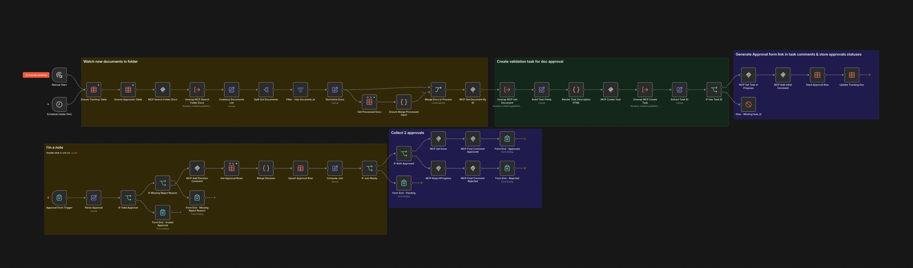

# WF02 — Document validation

**TL;DR** — Watch a **programming folder** for new documents, **create one validation task per file**, collect **two parallel approvals** (artistic vs technical) via **n8n Form** submissions, and **join** state in Data Tables so the task closes **only** when **both** sides approve. Demonstrates a richer pattern than a single-step native GED workflow. **No OpenAI** credential is required for this graph.

## n8n canvas

Folder sweep → dedup/merge → task with approval **Form** links → **Form trigger** branch per submission → **Switch** on persisted approval row → task status and comments. For the exact sequence and wiring, open [`workflow.json`](workflow.json) in n8n or read [SPEC.technical.md](SPEC.technical.md) (sections 11–12).

---

## Problem context

For festival programming (and similar programs), **editorial fit** and **operational feasibility** are **different concerns**, often validated by **different leads**. A single linear approval rarely matches reality; teams need **parallel review**, traceability in **comments**, and **persistent task state** until everyone agrees.

## Automation objective

- Detect **candidate documents** in a configured folder (`search_documents`).
- **Deduplicate / incremental processing** so the same unchanged file does not spawn duplicate tasks without cause (Data Table + merge logic; see technical spec).
- **Create** an eXo task with description containing document link and **approval deep links** (hosted **Form** URLs with query parameters).
- **Form trigger** branch records each submission; **join** logic (Switch + Data Table state) decides when **both** stamps are **APPROVED** vs partial / pending.
- Mirror decisions as **task comments** and drive **status** transitions (`update_task_status`) per product rules.
- On success across both branches, move to **Done** and record closure commentary as specified.

## Prerequisites

Create or locate the following **on eXo**, then copy identifiers into n8n **variables** (see [config.env.example](config.env.example) and [SPEC.functional.md](SPEC.functional.md) §9, [SPEC.technical.md](SPEC.technical.md) §11–12).

**eXo**

| Prerequisite | Why |
|--------------|-----|
| **Space** with a **document folder** used as the programming / intake area | Intake calls `search_documents` with a **`parent_folder_id`**. Default in the repo matches the **reference tenant** path under *Festival Art de Rue* / `00_Programmation` — **`WF02_PARENT_FOLDER_ID`** (see [SPEC.functional.md](SPEC.functional.md) §9.1). **Create** the tree or **note** the real folder id from the DMS UI / MCP. |
| **Task project (board)** — numeric **`project_id`** | `create_task_in_project` targets this board; demo default **`2`** on **reference tenant** — set **`WF02_PROJECT_ID`** for your tenant. |
| **Status ids** for *In progress* and *Done* (per project) | Call MCP **`list_project_statuses`** with your `project_id` and set **`WF02_INPROGRESS_STATUS_ID`** and **`WF02_DONE_STATUS_ID`** (defaults in [config.env.example](config.env.example) match project **2** on **reference tenant**). |
| **Actors** — usernames for **artistic** (`nadia`), **technical** (`etienne`), and **author fallback** (`claire`) | Must exist in the space; approval **links** in the first comment target these roles ([SPEC.functional.md](SPEC.functional.md) §3, §9.2). |
| **Sample documents** (optional) | Upload [fixtures/](fixtures/) into the watched folder to exercise intake end-to-end. |

**n8n**

| Prerequisite | Why |
|--------------|-----|
| **MCP Client** + tenant MCP URL (`npm run generate:workflow-json` or edit nodes) | All eXo mutations and reads use MCP. |
| **No OpenAI** | This portfolio workflow does not use LLM nodes; only MCP + Forms + Data Tables. |
| **Public approval / form base URL** — **`WF02_APPROVAL_BASE_URL`** | Must be the hosted **Form** URL (e.g. `.../form/...`), **not** a raw webhook path, so approvers get the n8n Form UI ([config.env.example](config.env.example) comment, [SPEC.technical.md](SPEC.technical.md) if referenced). |
| **Data Tables** `wf02_processed_documents` / `wf02_approvals` | Created on first run by the graph (`createIfNotExists`); **no manual SQL** required. |
| **Unwrap** sub-workflow id for deploy | **`N8N_WORKFLOW_ID_UNWRAP`** + [subworkflow-dependencies.json](subworkflow-dependencies.json). |

## Runtime variables

Set these in **n8n Variables** (or equivalent instance env mapping), because WF02 resolves them at runtime via `$vars.*`.

| Variable | Meaning | Where to set |
|----------|---------|--------------|
| `EXO_MCP_ENDPOINT` | MCP endpoint for document/task/comment/status operations. | Root `.env` → **`npm run generate:workflow-json`**. |
| `WF02_PARENT_FOLDER_ID` | Watched eXo folder id for document intake (baked into **`MCP Search Folder Docs`** Manual `parent_folder_id` via root **`.env`** at `generate:workflow-json` / deploy). | Root `.env` → generate or deploy injection; not an n8n `$vars` expression in the canonical graph. |
| `WF02_PROJECT_ID` | Target eXo project id where validation tasks are created. | **Canonical `workflow.json`** keeps a **numeric literal** (`2` on the reference tenant); root **`.env`** **`WF02_PROJECT_ID`** is applied by **`npm run generate:workflow-json`** and **`./tools/deploy.sh wf02`** into **`MCP Create Task`** (no n8n `$vars` needed for `project_id`). |
| `WF02_INPROGRESS_STATUS_ID` | Project status id used after create and on non-final outcomes. | n8n Variables. |
| `WF02_DONE_STATUS_ID` | Project status id used when both approvals are `APPROVED`. | n8n Variables. |
| `WF02_APPROVAL_BASE_URL` | Hosted n8n **Form** URL used in task comments for reviewer links. | n8n Variables. |

Use `config.env.example` as a naming/meaning template. Copy values into **n8n Variables** and/or root **`.env`**, then run **`npm run generate:workflow-json`** to hardcode matching expressions ([docs/DEVELOPMENT.md](../../docs/DEVELOPMENT.md)).

## High-level flow

1. **Intake** — manual start or scheduled run.
2. **Parallel reads** — branch A: `search_documents` → **Split Out** on **`content[0].text`**; branch B (same trigger): **Ensure Tracking Table** → **Get Processed Docs**. **Merge** (SQL) computes the differential so only **new or changed** files continue.
3. **Approvals persistence** — **`wf02_approvals`** is ensured **just before** the first seed (intake) or **just before** reading rows (form branch); same idempotent `createIfNotExists` pattern.
4. **Load document** — `get_document_by_id` on the raw MCP envelope (**`content[0].text`**); **HTML** description plus **`create_task_in_project`** fields pull from that node with **`Merge Docs to Process`** fallbacks (no intermediate unwrap/build Set nodes).
5. **Create task** — `create_task_in_project` (**UTIL unwrap** on the response), then move to **In progress**; add the first **comment** with instructions and approval URLs for **nadia** / **etienne** (demo actors).
6. **Form branch** — **`Approval Form`** receives `task_id`, `cycle_id`, role, decision, reason; MCP comments + status updates mirror each submission.
7. **Join & finalize** — **`Switch Approval Outcome`** after upsert: **both APPROVED** → **Done** + final comment; mixed approve/reject → stay **In progress** with explanation; otherwise **pending** until more submissions.

## n8n design choices

| Area          | Choice                                                 | Why                                                                                                                                                       |
| ------------- | ------------------------------------------------------ | --------------------------------------------------------------------------------------------------------------------------------------------------------- |
| Intake        | **Schedule + manual**                                  | Triggers start **two branches**: MCP folder search + **Ensure Tracking Table** → processed-doc read in parallel; **Merge** joins them. Approvals table is still ensured **just before** seed / form read.                                                                                     |
| Parallelism   | **Form submissions + approval table + Switch**         | Two **independent** human decisions over time; persisted rows encode **join** / partial-reject rules.                                                      |
| Idempotency   | **Data Table + Merge (SQL-style combine)**             | Same pattern as WF04: **skip** unchanged docs; avoid accidental duplicate tasks when rerunning intake.                                                    |
| MCP envelopes | **UTIL** for **create** only; **Split Out** for search; raw **`get_document`** | **`create_task_in_project`** uses **`Unwrap MCP JSON`**; **`search_documents`** splits **`content[0].text`** like WF04; **`get_document_by_id`** reads **`content[0].text`** directly ([SPEC.technical.md](SPEC.technical.md) §3.2–§3.3). |
| Code surface  | **HTML node** for task body (approval branch: **`Approval Form`** → **`IF Valid Approval`** → **Get Approval Rows** + MCP / Data Table expressions; **`Set Effective Decisions`** after **Upsert Approval Row** then **`Switch Approval Outcome`** — 3-way expression Switch on **`effectiveArtistic`** / **`effectiveTechnical`**) | Intake **`combineBySql`** Merge reads **`Get Processed Docs`** directly (**input 2**); **`alwaysOutputData`** on that Data Table node supports empty-table runs. |

## MCP eXo interaction model

Typical tools in this graph (see [SPEC.technical.md](SPEC.technical.md) §3):

- **Read / find** — `search_documents`, `get_document_by_id`
- **Context** — optional `list_projects`, `**list_project_statuses`** (resolve status ids per tenant), `list_users_of_space_by_role`
- **Mutate task** — `create_task_in_project`, `assign_task`, `add_task_comment`, `update_task_status`, `get_task_by_id`, `list_tasks`

Form submissions drive the approval branch; MCP carries **authoritative task updates** back into eXo.

## Operational considerations

- **Folder & project defaults** are pinned for the **reference tenant** demo; set **`WF02_PARENT_FOLDER_ID`** (and **`WF02_PROJECT_ID`**, status ids) in root **`.env`** and run **`npm run generate:workflow-json`** or REST deploy so literals match your tenant (see [SPEC.technical.md](SPEC.technical.md) §2 and §5.3).
- **Empty folder** — `search_documents` returns no rows; the run **stops without error** after the split (expected).
- **Sample files** for manual tests live in [fixtures/](fixtures/) — upload into the watched folder per [SPEC.functional.md](SPEC.functional.md) §9.

## References

| Artifact                                                       | Role                                                            |
| -------------------------------------------------------------- | --------------------------------------------------------------- |
| [workflow.json](workflow.json)                                 | Canonical n8n export.                                           |
| [SPEC.functional.md](SPEC.functional.md)                       | Actors, lifecycle, parallel approvals, acceptance criteria.     |
| [SPEC.technical.md](SPEC.technical.md)                         | MCP payloads, webhook design, Data Table merge, refactor notes. |
| [config.env.example](config.env.example)                       | Example n8n variables.                                          |
| [subworkflow-dependencies.json](subworkflow-dependencies.json) | Unwrap dependency for deploy.                                   |

---

## Testing with sample documents

The [`fixtures/`](fixtures/) directory holds **three example `.docx` files** with real content. They exist only in git so you can re-seed a tenant; they are **not** read by n8n from the repository.

To exercise the intake branch end-to-end:

1. In eXo (**reference tenant**), open the programming folder **`00_Programmation`** (full path in [`SPEC.functional.md`](SPEC.functional.md) §9.1). The default **`parent_folder_id`** in git is `ced6e9c539805e114bd65696b26bd073`; override via root **`.env`** `WF02_PARENT_FOLDER_ID` and **`npm run generate:workflow-json`** (or rely on deploy-time injection from the same key).
2. Upload the three files from `fixtures/` into that eXo folder (same filenames as in the repo).
3. Run the workflow in n8n (**Manual Start** or wait for **Schedule Intake (5m)**).

If the folder contains no matching documents, `search_documents` returns an empty list and the graph stops after the split step **without error** — that is expected until at least one file is present.

## REST deploy

From the repository root (unwrap dependency first, then parent): `./tools/deploy.sh wf02` (see [`docs/DEVELOPMENT.md`](../../docs/DEVELOPMENT.md)). Sub-workflow manifest: [`subworkflow-dependencies.json`](subworkflow-dependencies.json).