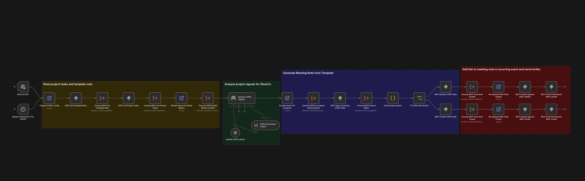

# WF03 — Weekly steering preparation (recurring collaboration ritual)

**TL;DR** — Automate the **weekly steering committee prep pack**: load a **note template**, ask an LLM for an **HTML progress narrative** plus a **suggested agenda** and **watch items** grounded in project tasks, and keep a **recurring calendar** entry pointing at the right **note for the week**. COPIL-style meeting habit, without the copy-paste.

## Video walkthrough

Prefer a short screencast before the long read? Replace the placeholder with your published URL (or embed) when ready.

**Short video:** *TBD*

## n8n canvas (overview)

Triggers → **Prepare Steering Config** (Set, including the `language` field) → **MCP List Project Tasks** → **Analyze Steering Signals** (AI Agent: returns agenda + HTML progress narrative + watch items + summary, all in the configured language) → **HTML Build AI Agenda** → split into **two parallel branches**:
- **Branch A (agenda event, early):** **MCP Update Agenda Event (Initial)** posts the weekly summary → **MCP Invite Participants** refreshes the attendee list.
- **Branch B (meeting note):** **MCP Get Template Note** → **HTML Build AI Watch Items** → **HTML Build Annexes Links** → **Compose Steering Note HTML** (Code) → **MCP Search Existing Note** → **IF Note Exists** routes to **MCP Update / Create Steering Note** → **Note Info** (Set: `note_url`, `note_id`).

Both branches re-converge in **Merge Branches**, then **HTML Build Agenda Description** assembles the final description with the meeting-note link and the AI agenda, and **MCP Update Agenda Event (Final)** posts it. Self-contained graph: no sub-workflow dependencies. For tool-level detail, open [`workflow.json`](workflow.json) and [SPEC.technical.md](SPEC.technical.md).

**Terminology:** **COPIL** is French project shorthand for a **steering committee** (*comité de pilotage*). In English, *steering committee* (or *steering group*) is the clearest wording. This workflow’s export still uses `COPIL` in several **node names** to match the demo environment; the portfolio workflow title uses English *steering*.

---

## Problem context

Governance meetings repeat on a **fixed cadence**, but preparation is often **manual**: re-open tasks, rewrite the same sections, fix links, and align the calendar invite. Teams want **one handout in eXo** (note + tasks + calendar) with **fresh content** each week and **minimal busywork**.

## Automation objective

- Determine **which occurrence** to prepare and the **meeting date** for titles.
- **Read** the template note and **create or update** the child note for that week.
- **List project tasks** and pass them to an **LLM** that returns at once: an HTML **progress narrative** (notable items, stalled work), a **suggested agenda**, short **watch items**, and a one-sentence summary — all grounded in data.
- **Create or update** the standing **agenda / calendar** object so participants open the **same invite** with the **correct note link** and the AI-suggested agenda.

## Prerequisites (eXo tenant and n8n)

WF03 binds to **specific eXo objects** (space, notes, project, agenda). On a **new tenant**, create the corresponding **space / note / project / calendar** structure (or clone the demo layout), then read ids from the eXo UI or MCP calls described in [SPEC.technical.md](SPEC.technical.md). Align n8n **variables** with [config.env.example](config.env.example).

**eXo (ids are examples from the reference build — replace for your tenant)**

| Prerequisite | Variable (typical) | Why |
|--------------|-------------------|-----|
| **Space** for festival / program | **`WF03_SPACE_ID`** | Scopes notes, tasks, and events. |
| **Template note** the workflow reads to seed content | **`WF03_TEMPLATE_NOTE_ID`** | Source for the weekly handout structure. |
| **Parent note** under which **weekly child notes** are created | **`WF03_REPORTS_PARENT_NOTE_ID`** | Anchors generated notes in the tree. |
| **Task project** for the **AI progress report** | **`WF03_PROJECT_ID`** | `list_tasks` / project task list fed to the LLM. |
| **Agenda / parent event** for the **recurring meeting** link | **`WF03_AGENDA_PARENT_EVENT_ID`** | Calendar object updated to point at the current week’s note. |
| **Meeting owner label** (string) | **`WF03_MEETING_OWNER`** | Display / context in generated content. |
| **Output language** (free-form string) | **`WF03_LANGUAGE`** | Imposes the language of all AI-generated content (progress narrative subsection headings, vigilance titles + decision labels, three agenda description fields). Default `English` if unset. |
| **Attendee usernames** (comma-separated) | **`WF03_ATTENDEE_USERNAMES`** | Must **exist** on the tenant (`claire`, `etienne`, … per [SPEC.functional.md](SPEC.functional.md) §4). |
| **LLM tuning** (optional) | **`WF03_STAGNATION_DAYS`**, **`WF03_BLOCKED_DAYS`**, **`WF03_OVERLOAD_THRESHOLD`** | Thresholds for “watch list” suggestions in [config.env.example](config.env.example). |

**n8n**

| Prerequisite | Why |
|--------------|-----|
| **MCP OAuth** + tenant MCP URL (`npm run generate:workflow-json` or edit nodes) | Notes, tasks, agenda calls. |
| **OpenAI** (or equivalent) for LLM nodes | Agenda / watch suggestions. |
| **No sub-workflow dependencies** (didactic slice) | WF03 is self-contained; only `N8N_WORKFLOW_ID_WF03` is required in root `.env`. The previous Unwrap / build-report / compose UTILs were inlined into the parent graph (ADR 0004). |

If any id is wrong, **create/upsert** paths in the technical spec may **fail** or link the **wrong** object — verify ids after a tenant copy.

## Runtime variables (what they mean, and where to set them)

Set these in **repository root `.env`** (no n8n Variables / `$vars` needed for this didactic slice). REST deploy (`./tools/deploy.sh wf03`) and **`npm run generate:workflow-json`** rewrite the **`Prepare Steering Config`** Set node assignments in-memory / on disk via the helper **`applyWf03PrepareSteeringConfigFromEnv`** ([`tools/lib/n8n-workflow-deploy-core.mjs`](../../tools/lib/n8n-workflow-deploy-core.mjs)).

| Variable | Meaning | Where to set |
|----------|---------|--------------|
| `EXO_MCP_ENDPOINT` | MCP endpoint for notes/tasks/agenda calls. | Root `.env` → **`npm run generate:workflow-json`** or in-memory before REST deploy. |
| `WF03_SPACE_ID` | eXo space id used by the workflow scope. | Root `.env`. |
| `WF03_PROJECT_ID` | eXo project id used for the progress report table. | Root `.env`. |
| `WF03_TEMPLATE_NOTE_ID` | Template note id used as source content. | Root `.env`. |
| `WF03_REPORTS_PARENT_NOTE_ID` | Parent note id where weekly notes are created/updated. | Root `.env`. |
| `WF03_AGENDA_PARENT_EVENT_ID` | Stable agenda event id updated with the note link. | Root `.env`. |
| `WF03_MEETING_OWNER` | Label used in generated meeting content. | Root `.env`. |
| `WF03_LANGUAGE` | Output language imposed on the AI agent (free-form, e.g. `English`, `Français`). Defaults to `English`. | Root `.env`. |
| `WF03_ATTENDEE_USERNAMES` | Comma-separated attendee usernames for agenda updates. | Root `.env`. |
| `WF03_STAGNATION_DAYS`, `WF03_BLOCKED_DAYS`, `WF03_OVERLOAD_THRESHOLD` | LLM/watch-list thresholds. | Root `.env`. |

Deploy-time id (`N8N_WORKFLOW_ID_WF03`) belongs to root `.env` for repository tooling.

## High-level flow (conceptual)

1. **Trigger** — scheduled prep before the meeting slot (implementation detail in `workflow.json`).
2. **Resolve time / week** — `Prepare Steering Config` (Set) emits the meeting date, related dates, the note title, ids, roster, thresholds, the output `language`, and the eXo URL building blocks.
3. **Tasks** — list project tasks (`MCP List Project Tasks`).
4. **LLM assist (single call)** — `Analyze Steering Signals` receives the task list, the meeting context, and the configured `language`. It returns structured `{ suggested_agenda, progress_report (HTML), vigilances, summary, agenda_label_support, agenda_label_agenda, agenda_outro_text }` with all strings in that language. `HTML Build AI Agenda` renders the suggested agenda as a `<ul>` and is the split point for the two-branch sequel.
5. **Branch A — agenda event (early)** — `MCP Update Agenda Event (Initial)` posts the weekly summary on the recurring event; `MCP Invite Participants` refreshes the attendee list.
6. **Branch B — meeting note** — `MCP Get Template Note` reads the template body; `HTML Build AI Watch Items` + `HTML Build Annexes Links` + one short `Compose Steering Note HTML` Code node patches the template tokens with the four section blocks (`[SUGGESTED_AGENDA_*]`, `[REPORT_AVANCEMENT_*]` ← `progress_report`, `[POINTS_A_DISCUTER_*]`, `[ANNEXES_LIENS_*]`); `MCP Search Existing Note` + `IF Note Exists` decide between `MCP Update / Create Steering Note`; `Note Info` (Set) extracts the resulting `note_url` and `note_id`.
7. **Merge and finalize** — `Merge Branches` synchronizes both branches, `HTML Build Agenda Description` composes the final agenda event description (localized label, link to the meeting-support note, AI agenda, localized outro), and `MCP Update Agenda Event (Final)` posts it.

## n8n design choices (not a node-by-node list)

| Area               | Choice                                                                                                | Why                                                                                                                                                          |
| ------------------ | ----------------------------------------------------------------------------------------------------- | ------------------------------------------------------------------------------------------------------------------------------------------------------------ |
| Readability        | **Self-contained parent graph** (no sub-workflows)                                                    | Tutorial-oriented (ADR 0004 didactic slice): every step on the canvas maps to one clear idea.                                                                |
| Two-branch structure | **Parallel branches** after `HTML Build AI Agenda` (Branch A = agenda event setup; Branch B = meeting note composition), re-merged by `Merge Branches` before the final agenda description update | Posts the weekly summary on the agenda event as early as possible (no need to wait for the note to be composed) and **consolidates six previously duplicated nodes** (`HTML Build Agenda Description (Update/Create)`, `MCP Update Agenda After Update/Create`, `MCP Invite Participants After Update/Create`) into a single post-merge trail. |
| Progress report    | **AI narrative** (HTML emitted by the LLM via `progress_report`), no static HTML table                | Tabular projection duplicated information already legible inside eXo Tasks; a narrative surfaces notable items and stalled work more clearly for a steering meeting. Removed: `Split Out Tasks`, `HTML Render Task Row`, `Aggregate Task Rows`, `HTML Build Progress Table`. |
| Language           | **Imposed via configuration** (`WF03_LANGUAGE`, rewritten into `Prepare Steering Config.language` at deploy) | Replaces previous LLM-side language detection from the template body. Predictable output across tenants and reruns; no template body in the prompt; one knob to flip for a multilingual rollout. |
| MCP parsing        | Direct **`content[0].text.<field>`** expressions                                                      | Same trust-the-data pattern as WF02; no Unwrap UTIL hops.                                                                                                    |
| Native vs Code     | **HTML node** for every fixed-layout block; **one short Code** for template token surgery             | Aligns with ADR 0004: prefer native nodes, reserve Code for logic that is genuinely shorter or safer in script.                                              |
| Configuration      | **Plain literals** in `workflow.json`; deploy rewrites from root `.env`                               | No n8n Variables / `$vars.*` (avoids Cloud-tenant inconsistencies). See [config.env.example](config.env.example) and `applyWf03PrepareSteeringConfigFromEnv`. |
| Technical contract | Single **SPEC.technical.md** for this workflow                                                        | Keeps one source of truth for payloads, sequence, and operations.                                                                                            |

## MCP eXo interaction model

WF03 is the **broadest** demo: it touches **Notes**, **Tasks**, and **Agenda / calendar** capabilities documented in [SPEC.technical.md](SPEC.technical.md). Use that spec for exact tool names, payload shapes, and operational constraints.

## Operational considerations

- **Variables and ids** — space, template parent, project, note, and agenda references are **demo-specific**; align to your tenant by setting `WF03_*` in repository root `.env` (no n8n Variables / `$vars` for this didactic slice). See [config.env.example](config.env.example) and the technical specs.
- **OAuth / OpenAI** — MCP and the LLM nodes must be **authorized** on the target n8n instance.
- **Trust the data** — MCP envelopes are read directly as `content[0].text.<field>`. A tenant that wraps responses differently will surface as a downstream expression error rather than a silent fallback (see [SPEC.technical.md](SPEC.technical.md) §3.2, §7).

## References

| Artifact                                                                   | Role                                                                                       |
| -------------------------------------------------------------------------- | ------------------------------------------------------------------------------------------ |
| [workflow.json](workflow.json)                                             | Canonical n8n export (see [ADR 0002](../../docs/ADR/0002-repository-layout-workflows.md)). |
| [SPEC.functional.md](SPEC.functional.md)                                   | Goals, actors, note shape, business rules.                                                 |
| [SPEC.technical.md](SPEC.technical.md)                                     | MCP technical contract (notes, projects, agenda, sequence, operations).                    |
| [fixtures/steering-template-note.md](fixtures/steering-template-note.md)   | Editorial note template reference.                                                         |
| [fixtures/api-response.snapshot.json](fixtures/api-response.snapshot.json) | Raw API response snapshot (traceability).                                                  |
| [config.env.example](config.env.example)                                   | Example `.env` keys (injected as canonical literals by deploy).                            |

---

## Repository file map

| File                                                                         | Role                                                                                       |
| ---------------------------------------------------------------------------- | ------------------------------------------------------------------------------------------ |
| [`workflow.json`](workflow.json)                                             | Canonical n8n export (see [ADR 0002](../../docs/ADR/0002-repository-layout-workflows.md)). |
| [`fixtures/api-response.snapshot.json`](fixtures/api-response.snapshot.json) | Raw API response (workflow + `triggerInfo`) kept for traceability.                         |
| [`SPEC.functional.md`](SPEC.functional.md)                                   | Goals, rules, and acceptance criteria.                                                     |
| [`SPEC.technical.md`](SPEC.technical.md)                                     | MCP technical contract (notes, projects, agenda, sequence, operations).                    |
| [`fixtures/steering-template-note.md`](fixtures/steering-template-note.md)   | Note template (editorial reference).                                                       |
| [`config.env.example`](config.env.example)                                   | Example `.env` keys.                                                                       |

## Sub-workflows

**None.** The didactic slice (ADR 0004) inlined the former WF03 UTILs (`UTIL - WF03 build report context`, `UTIL - WF03 compose steering note HTML`) and all `Unwrap MCP JSON` hops into the parent graph. There is no `subworkflow-dependencies.json` for this workflow; only the parent id `N8N_WORKFLOW_ID_WF03` matters in root `.env`. See [SPEC.technical.md §7](SPEC.technical.md#7-didactic-simplification-slice-adr-0004) for deferred hardening (reintroduce unwrap UTILs only if a tenant's MCP envelopes diverge from `content[0].text.<field>`).

## Identifiers (from spec)

- n8n workflow: `1suyxKutB174p7b4` (name on the instance: `WF03 - Weekly steering preparation`).

## Code vs native

WF03's main graph favors **Set**, **HTML**, and **IF** native nodes around the **AI Agent** + **Structured Output** core, with one short **`Compose Steering Note HTML`** Code node (template token surgery). See [docs/ISSUES.md](../../docs/ISSUES.md) for any optional further tweaks.

## Import and deploy

**REST (recommended):** From the repo root, `./tools/deploy.sh wf03` (see [docs/DEVELOPMENT.md](../../docs/DEVELOPMENT.md#portfolio-deploy-dependencies-manifest)). On a fresh tenant, leave `N8N_WORKFLOW_ID_WF03` empty in `.env`: deploy POST-creates the workflow and writes the new id back automatically (see [Deploy bootstrap](../../docs/DEVELOPMENT.md#deploy-bootstrap-env-driven)). Use `./tools/deploy.sh wf03 --dry-run` once the id is set to preview the PUT target.

**Manual UI:** Import `workflow.json` (or MCP `validate_workflow` / `update_workflow`). Use **`npm run generate:workflow-json`** (root `.env`) so MCP **`endpointUrl`** and `WF03_*` literals match your tenant; verify MCP OAuth and OpenAI on the target instance.