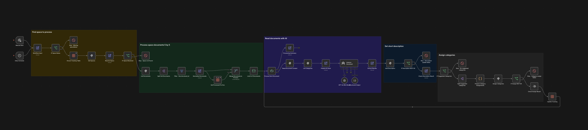

# WF04 — Metadata enrichment

**TL;DR** — On a **schedule** or **manual** run, use a configured eXo **`space_id`** (**`WF04_SPACE_ID`**) to **scan** documents, and for each **new or changed** file (within a **per-run cap**) call **structured LLM output** to propose a **short description** and **categories**, then **write back** through MCP and **record state** in an n8n **Data Table** so reruns stay incremental. **`EXO_SPACE_NAME`** labels tracking and LLM context.

## n8n canvas

**Manual Start** or **Daily Schedule (02:00)** fan out to **List Documents** (MCP), **Ensure Tracking Table**, and **Ensure Category Table** in parallel → merge/filter → rendezvous at **Ready to Process** (**Merge**, **chooseBranch**: wait for **`Limit to 5 Documents`** + **`Get Categories`**, output documents only) so the category table is refreshed before **`Process Each Document`** → per-item **`Read Document`** + structured LLM → Data Table category lookup → MCP updates → tracking upsert. For the exact sequence, open [`workflow.json`](workflow.json) or read [SPEC.technical.md](SPEC.technical.md) (sections 3–4).

---

## Problem context

Without steady upkeep, document libraries accumulate **weak titles**, **missing descriptions**, and **inconsistent tagging**. Manual cleanup does not scale; fully automated tagging without guardrails can **overwrite** trusted metadata. Teams need a **hybrid**: platform writes with **AI assist**, **bounded batch size**, and **idempotency**.

## Automation objective

- **List** space documents via **`search_documents`** using **`space_id`** from **List Documents** MCP **Manual** parameters (demo **`1`** in git; root **`.env`** **`WF04_SPACE_ID`** via **`npm run generate:workflow-json`** / deploy).
- **Ensure** tracking and category Data Tables on **parallel branches** before reads and merges (same idempotency pattern as WF02).
- **Split** the MCP payload into one item per document and **merge** with tracking so only **new or changed** files continue, then apply a **per-run cap** (**`Limit to 5 Documents`**).
- **Warm** **`exo_category_cache`** from **`get_category_tree`** before the document loop; assign categories only when **`Lookup Category By Label`** resolves an exact **`category_label`**.
- For each selected item: **read** full document context, run **structured** LLM analysis, **update description**, **assign categories** via MCP, **upsert** tracking, and emit a short **processing summary**.

There is **no** in-graph guard on empty **`EXO_SPACE_NAME`** or invalid **`space_id`** (didactic trade-off — see [SPEC.technical.md](SPEC.technical.md) §7).

## Prerequisites

WF04 needs a **document space**, a **category tree** with usable labels, and MCP write permissions. On a new tenant, discover **`space_id`** once during bootstrap, then align root `.env` with [config.env.example](config.env.example). Details: [SPEC.technical.md](SPEC.technical.md) §2.

**eXo**

| Prerequisite | Typical setup | Why |
|--------------|---------------|-----|
| **Space** | **`WF04_SPACE_ID`** (digits) + **`EXO_SPACE_NAME`** (display label) | The graph does **not** call **`get_my_spaces`** at runtime — use [fixtures/FIXTURE_BOOTSTRAP_PROMPT.md](fixtures/FIXTURE_BOOTSTRAP_PROMPT.md). Wrong **`WF04_SPACE_ID`** targets the wrong library. |
| **Documents** in that space | Listed by `search_documents` | An **empty** space yields **no work** (not an error). |
| **Category tree** | Labels from **`get_category_tree`** | **`exo_category_cache`** stores **`category_id`** / **`category_label`**; LLM suggestions must **match labels exactly** for assignment. |
| **MCP write access** | `update_document_description`, `add_content_to_category` | Writes must be allowed for the MCP user. |

**n8n**

| Prerequisite | Why |
|--------------|-----|
| **MCP OAuth** + `EXO_MCP_ENDPOINT` | All reads and writes are MCP-first; rewrite endpoint with **`npm run generate:workflow-json`** or deploy. |
| **OpenAI** or equivalent | **`gpt-4o-mini`** structured output for description and categories. |
| **Data Tables** | `exo_processed_documents` and **`exo_category_cache`** — auto-created by the graph; no manual bootstrap. |
| **Deploy id** | `N8N_WORKFLOW_ID_WF04` in root `.env` for REST deploy. |

**`WF04_SPACE_ID`** and **`EXO_SPACE_NAME`** in root **`.env`** are rewritten into **`workflow.json`** literals by **`npm run generate:workflow-json`** and/or deploy — the canonical graph does **not** use n8n **`$vars`** for these keys.

Wrong **`WF04_SPACE_ID`** or misaligned **`EXO_SPACE_NAME`** misroute scans or confuse tracking labels with no in-graph validation.

## Runtime variables

Set keys in **repository root `.env`**. **`./tools/deploy.sh wf04`** and **`npm run generate:workflow-json`** rewrite **List Documents** `space_id` and **Prepare AI Input** `spaceName` literals ([`tools/lib/n8n-workflow-deploy-core.mjs`](../../tools/lib/n8n-workflow-deploy-core.mjs)). No n8n Variables / `$vars.*` at runtime for WF04 space keys.

| Variable | Meaning |
|----------|---------|
| `EXO_MCP_ENDPOINT` | MCP endpoint for all WF04 MCP Client nodes. |
| `WF04_SPACE_ID` | eXo **`space_id`** (digits) for **`search_documents`** — plain integer in **List Documents** MCP **Manual** `parameters.value`. |
| `EXO_SPACE_NAME` | Display / tracking / LLM context string in **Prepare AI Input** `spaceName` literal. |
| `N8N_WORKFLOW_ID_WF04` | Remote workflow id for REST deploy; empty on first POST-create. |

## High-level flow

1. **Trigger** — **Manual Start** or **Daily Schedule** (02:00).
2. **Parallel** — **`List Documents`** (MCP **`search_documents`**) on one branch; **`Ensure Tracking Table`** → **`Get Processed For Doc`** on another; both feed the **Merge** that picks new/changed docs.
3. **Search & split** — **Split Out** expands hits; **Merge** SQL compares **`document_id`** / **`updated_date`** to the tracking table.
4. **Incremental filter** — apply **per-run limit** (**`Limit to 5 Documents`**).
5. **Category prefetch** — **`Ensure Category Table`** → **`get_category_tree`** (`executeOnce`) → **`Flatten Category Tree`** → **`Sync Category Table`** → **`Get Categories`**; **`Ready to Process`** waits with **`Limit to 5 Documents`** before **`Process Each Document`**.
6. **Per document** — `get_document_by_id`, structured LLM, **`update_document_description`**, category lookup and **`add_content_to_category`** when labels match; **`content_id`** as **`/document:`** + id.
7. **Record & summarize** — upsert tracking; aggregate counts.

## n8n design choices

| Area | Choice | Why |
|------|--------|-----|
| Safety | **Hard cap** on documents per execution | Prevents runaway LLM + MCP cost on large libraries ([SPEC.functional.md](SPEC.functional.md)). |
| Correctness | **Structured LLM output** (schema) | Keeps descriptions short and categories machine-verifiable before MCP writes. |
| Idempotency | **Data Table `exo_processed_documents`** | Same pattern as WF02: **ensure table** on a parallel branch before **read-all** processed rows, then merge — **skip** unchanged docs across days. |
| Categories | **`exo_category_cache`** refreshed each run | Tenant labels vary; exact string match required for assignment. |
| Failure handling | **Explicit stops** after partial writes | Documented in technical spec when description succeeds but category assignment fails. |
| MCP | **No REST fallback** | MCP-first portfolio consistency ([SPEC.technical.md](SPEC.technical.md)). |

## MCP eXo interaction model

Tools used:

- **`search_documents`** — enumerate candidates in the space.
- **`get_document_by_id`** — fetch details for enrichment.
- **`get_category_tree`** — called **once** per execution; **`Flatten Category Tree`** (Code) walks nested JSON before **`Sync Category Table`**.
- **`update_document_description`** — persist summary text.
- **`add_content_to_category`** — attach resolved categories.

See [SPEC.technical.md](SPEC.technical.md) §3 for envelope shape, write order, and lookup rules.

## Operational considerations

- **Demo literals** — set **`WF04_SPACE_ID`** and **`EXO_SPACE_NAME`** in root **`.env`** and run **`npm run generate:workflow-json`** or **`./tools/deploy.sh wf04`** before testing on a new tenant.
- **OAuth / OpenAI** — authorize MCP and LLM credentials on the target n8n instance.
- **Category labels** — LLM suggestions must **mirror** tenant labels exactly or assignment is skipped; the graph refreshes **`exo_category_cache`** each run.
- **Per-run cap** and **no rollback** on partial failure — see [SPEC.functional.md](SPEC.functional.md) §4.

## Code vs native

The graph uses **Split Out**, **Merge**, **IF**, **Data Table**, and an **AI Agent** with structured output, plus one **`Flatten Category Tree`** Code node for nested category JSON — no other custom Code on the main path.

## Import and deploy

**REST:** From the repo root, `./tools/deploy.sh wf04` — see [docs/DEVELOPMENT.md](../../docs/DEVELOPMENT.md). No `subworkflow-dependencies.json`. On a fresh tenant, leave `N8N_WORKFLOW_ID_WF04` empty: the first deploy POST-creates the workflow and writes the id back — [Deploy bootstrap](../../docs/DEVELOPMENT.md#deploy-bootstrap-env-driven). Use `--dry-run` to preview the PUT target once the id is set.

**Manual UI:** Import `workflow.json`. Run **`npm run generate:workflow-json`** so `EXO_MCP_ENDPOINT`, `WF04_SPACE_ID`, and `EXO_SPACE_NAME` match your tenant; verify MCP OAuth and OpenAI on the instance. Demo verification steps: [SPEC.technical.md](SPEC.technical.md) §6.

## References

| Artifact | Role |
|----------|------|
| [workflow.json](workflow.json) | Canonical export — name on instance: `WF04 - Metadata enrichment`. |
| [SPEC.functional.md](SPEC.functional.md) | Goals, limits, acceptance criteria. |
| [SPEC.technical.md](SPEC.technical.md) | Sequence, MCP tools, Data Table, LLM schema, demo runbook. |
| [config.env.example](config.env.example) | Example `.env` keys. |
| [fixtures/FIXTURE_BOOTSTRAP_PROMPT.md](fixtures/FIXTURE_BOOTSTRAP_PROMPT.md) | Tenant bootstrap prompt for space id and display name. |
| [fixtures/workflow.export.snapshot.json](fixtures/workflow.export.snapshot.json) | Secondary full snapshot (traceability). |
